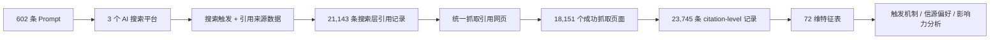

# Overseas GEO Research

一套面向 `ChatGPT`、`Google AI Overview / Gemini`、`Perplexity` 的 GEO 研究资料库，用来回答三个实际问题：

- 什么样的问题最容易触发 AI 去联网搜索？
- AI 搜索最爱选什么样的来源网站？
- 什么样的页面会被 AI 深度吸收，而不只是“挂名引用”？

这份仓库不是泛泛而谈的 GEO 观点集，而是一份基于真实问答、真实引用、真实页面抓取结果做出来的研究快照。

## Start Here

作者与贡献：

- 张凯：提出研究想法与需求，定义分析目标与相关规则；微信号：`seermartech`
- 贺欣悦：负责源代码实现、数据采集与清洗、初稿撰写；清华大学本科，清华大学与华盛顿大学 `GIX` 项目的双学位硕士生；GitHub 主页：[shirley-goose](https://github.com/shirley-goose)
- 姚金刚：负责开源整理、二次报告解读与应用场景梳理；Live Site：[https://yaojingang.github.io/geo-citation-lab/](https://yaojingang.github.io/geo-citation-lab/)

仓库首页建议先从这五个入口进入：

| 入口 | 文件 | 适合谁 |
| --- | --- | --- |
| 长版 HTML 报告 | [04-repet/final_report.html](./04-repet/final_report.html) | 想快速浏览完整内容、适合本地或浏览器阅读 |
| 长版 Markdown 报告 | [04-repet/final_report.md](./04-repet/final_report.md) | 想在 GitHub 里直接按章节阅读正文 |
| PDF 版报告 | [04-repet/final_report.pdf](./04-repet/final_report.pdf) | 想下载、分享或打印 |
| 3 分钟摘要 | [QUICK_REPORT.md](./QUICK_REPORT.md) | 想先快速判断这份研究讲了什么，再决定是否进入长版 |
| arXiv 论文 | [Abstract](https://arxiv.org/abs/2604.25707) / [PDF Paper](https://arxiv.org/pdf/2604.25707) | 想直接查看论文原文、引用学术版本或下载论文 PDF |

## Snapshot

| 项目 | 数字 |
| --- | ---: |
| 设计 Prompt 总数 | 602 |
| A/B/C/D 四层实验 | 432 / 60 / 60 / 50 |
| 平台数量 | 3 |
| 搜索层原始结果行数（清洗后） | 21,181 |
| 搜索层有效引用行数 | 21,143 |
| 引用影响力特征行数 | 23,745 |
| 特征维度 | 72 |
| 成功抓取的引用页面 | 18,151 |
| 抓取成功率 | 76.44% |

## 为什么这份仓库值得看

- 它同时研究了“触发搜索”和“引用吸收”两条链路，而不只是统计谁被引用了多少次。
- 它把 GEO 拆成了可验证变量：Prompt 设计、站点权威度、页面结构、语义对齐、内容类型、平台差异。
- 它保留了原始 Prompt、原始 CSV、处理脚本、完整报告、可视化 PDF，可以直接复查每个结论的来源。

## 研究逻辑



这套实验的核心设计分成四层：

- `A 层`：432 条主实验 Prompt，系统控制任务类型、触发强度、时效性、行业与子任务。
- `B 层`：60 条风格对照 Prompt，比较自然问法、要求来源、专家角色三种包装方式。
- `C 层`：60 条中英双语对照 Prompt，观察不同语言环境下的搜索强度与信源偏好。
- `D 层`：50 条极端与真实场景 Prompt，覆盖高风险、模糊、多约束和长决策型问题。

## 平台差异，先看结论

| 平台 | 搜索触发率 | 平均每条 Prompt 引用数 | 单条引用平均影响力 |
| --- | ---: | ---: | ---: |
| ChatGPT | 98.64%（579 / 587） | 6.88 | 0.2567 |
| Google | 99.67%（600 / 602） | 12.06 | 0.0455 |
| Perplexity | 100.00%（602 / 602） | 16.35 | 0.0548 |

这张表基本定义了三家的策略：

- `ChatGPT` 引用更少，但单条引用被用得更深。
- `Google` 引用更广，尤其吃“带来源要求”的查询。
- `Perplexity` 最激进，覆盖面最大，更像“广撒网式”信息汇总器。

## 核心发现

- 三个平台几乎都会触发搜索，但触发之后的“引用宽度”差距很大：`6.88 vs 12.06 vs 16.35`。
- 搜索广度不等于引用深度：ChatGPT 的单条引用平均影响力是 Google 的 `5.64x`，是 Perplexity 的 `4.68x`。
- 在 `B 层` 风格实验里，要求来源的 Prompt 平均引用数最高，整体达到 `13.07`，高于自然提问的 `12.35`。
- 在 `C 层` 语言实验里，英文 Prompt 整体平均引用数为 `11.68`，高于中文 Prompt 的 `10.41`；Google 上差异更大，`11.57 vs 7.53`。
- 在 `D 层` 场景实验里，模糊问题的平均引用数最低，仅 `9.97`；长决策型问题达到 `13.70`。
- 三个平台引用的网站中，`官网 + 新闻 + 行业垂类` 占比达到 `79.12% - 87.52%`。
- 在可识别国家中，`US` 来源占比达到 `82.70% - 86.76%`；在可识别语言中，英文来源占比达到 `82.90% - 95.07%`。
- 被引用来源的中位 `Final_DR` 落在 `526 - 592`，说明高权威域名依旧显著占优。
- 影响力 Top 四分位页面平均 `1,943` 词，Bottom 四分位仅 `170` 词，长度差达到 `11.4x`。
- Top 四分位页面平均 `10.59` 个标题、`47.49` 个段落，显著高于 Bottom 四分位的 `0.85` 和 `8.34`。
- 影响力最强的独立预测因子是语义相关性：`llm_relevance_score` 与影响力相关系数 `r = 0.432`。
- 含数字、定义、对比、步骤的页面显著更强：平均影响力提升分别为 `+61.6%`、`+57.3%`、`+55.3%`、`+41.2%`。
- 纯问答格式并没有帮助，`Q&A` 页面平均影响力反而比非 Q&A 页面低 `5.7%`。

普通用户可以先看 [QUICK_REPORT.md](./QUICK_REPORT.md)，想看完整论证再读 [04-repet/final_report.md](./04-repet/final_report.md) 或 [05-kami-report/kami_geo_research_summary_report.pdf](./05-kami-report/kami_geo_research_summary_report.pdf)。

## 仓库结构

| 路径 | 作用 |
| --- | --- |
| [`01-prompt/`](./01-prompt/) | 602 条实验 Prompt |
| [`02-data/`](./02-data/) | 搜索层 CSV 与 72 维特征 CSV |
| [`03-pipeline/`](./03-pipeline/) | 解析、抓取、特征提取、分析脚本 |
| [`04-repet/`](./04-repet/) | 完整研究报告及图表 |
| [`05-kami-report/`](./05-kami-report/) | 更适合展示/分享的摘要 PDF |
| [`QUICK_REPORT.md`](./QUICK_REPORT.md) | 给普通用户的 3 分钟速读版 |

## 如何阅读这份仓库

如果你是第一次接触 GEO，建议按这个顺序：

1. 读 [QUICK_REPORT.md](./QUICK_REPORT.md)，先拿到“这份数据到底证明了什么”。
2. 读 [04-repet/final_report.md](./04-repet/final_report.md)，看完整方法、图表和章节论证。
3. 打开 [`02-data/features_all_platforms_72.csv`](./02-data/features_all_platforms_72.csv)，直接筛你关心的字段。
4. 再读 [`03-pipeline/citation_features.py`](./03-pipeline/citation_features.py) 和 [`03-pipeline/analyze_influence.py`](./03-pipeline/analyze_influence.py)，看这些结论是怎么生成的。

## 公开仓库的运行方式

本仓库已将脚本改为从环境变量读取密钥，避免把私钥直接放进 GitHub。

先复制一份环境变量模板：

```bash
cp .env.example .env
```

或直接导出：

```bash
export OPENAI_API_KEY=...
export GEMINI_API_KEY=...
export DATAFORSEO_BASE64_AUTH=...
export AHREFS_API_KEY=...
export BATCH_API_TOKEN=...
export BATCH_API_BASE_URL=http://188.166.211.11:9000
```

常见重跑方式：

```bash
cd 03-pipeline
python3 analyze_influence.py \
  --input ../02-data/features_all_platforms_72.csv \
  --output ../04-repet/citation_influence_report.md
```

```bash
cd 04-repet
python3 build_self_contained_html.py
```

## 数据说明与已知 caveats

- `chatgpt_results_with_prompt.csv` 原始文件中混入了 `16` 行重复表头，统计时需要先清洗。
- ChatGPT 搜索层的 `A_news`、`A_technology` 在原始文件里命名为 `Anews*`、`Atechnology*`，需要先做命名归一化。
- ChatGPT 搜索层清洗后覆盖 `587` 个 Prompt，仍缺 `15` 个 Prompt 输出。
- `国家(Country)` 和 `语言(Language)` 中存在大量 `unknown` 或 `WW`，因此地区/语言占比最好同时给出“可识别样本口径”。
- `网站类型` 字段里存在少量噪声值，例如 `成功`，这类值更适合在公开版里再做一次标准化。
- 仓库当前没有给每条记录附统一采集时间戳；它更适合作为一次“静态研究快照”来理解，而不是实时监控数据源。

## 适合哪些人

- 想理解 GEO 底层逻辑的内容策略、SEO、品牌投放人员
- 想研究 AI 搜索引用机制的分析师或研究者
- 想基于真实数据做二次分析、二次可视化或公开展示的开发者

## 相关文档

- [QUICK_REPORT.md](./QUICK_REPORT.md)
- [04-repet/final_report.md](./04-repet/final_report.md)
- [04-repet/final_report.pdf](./04-repet/final_report.pdf)
- [05-kami-report/kami_geo_research_summary_report.pdf](./05-kami-report/kami_geo_research_summary_report.pdf)
